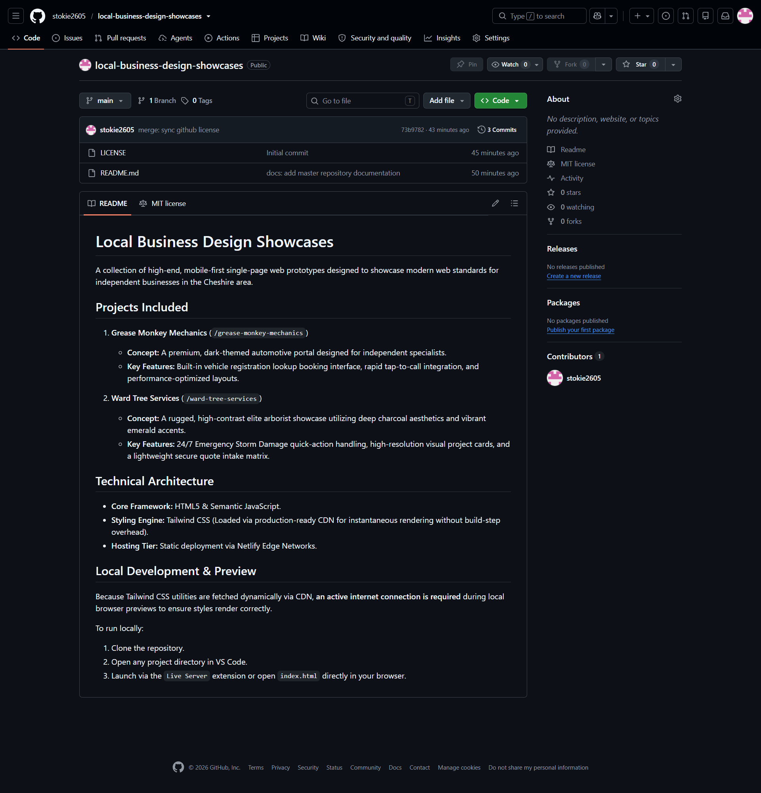

# Local Business Design Showcases

A collection of high-end, mobile-first single-page web prototypes designed to showcase modern web standards for independent businesses in the Cheshire area.

---

## 1. Grease Monkey Mechanics
**Concept:** A premium, dark-themed automotive portal designed for independent specialists.
**Key Features:** Built-in vehicle registration lookup booking interface, rapid tap-to-call integration, and performance-optimized layouts.

### Preview

---

## 2. Ward Tree Services
**Concept:** A rugged, high-contrast elite arborist showcase utilizing vibrant orange accents.
**Key Features:** Custom client-side Light/Dark mode state persistence (localStorage), rapid emergency response layout, and a lightweight intake matrix.

### Preview

---

## Technical Architecture
* **Core Framework:** HTML5 & Semantic JavaScript.
* **Styling Engine:** Tailwind CSS (Loaded via production-ready CDN for instantaneous rendering without build-step overhead).
* **Hosting Tier:** Static deployment via Netlify Edge Networks.
---
